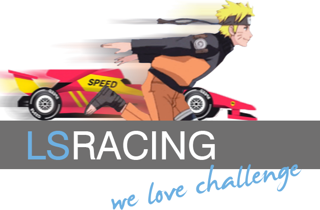

<p align="center">
  
</p>

# LS Racing Simulator

[](https://github.com/alejandrov44/LS_Racing/blob/master/README.md)
[](https://github.com/alejandrov44/LS_Racing/blob/master/README.es.md)

Project carried out with all our sweat and tears from [Blak](https://github.com/blakjord) and [me](https://github.com/alejandrov44).

Customize your car to win a tournament vs the IA!

This is a simple racing simulator game written in C, using the Allegro 5 library for graphics and input, it was one of my university practices, in the subject of advanced C and how operating systems work.

## 📚 Prerequisites instalation

* **Clone the Repository**: Copy the repository to your local system.

* **CMake (3.15 or higher):** Required for building the project. [Link](https://cmake.org/download/)

* **Standard MinGW 32-bit (4.8 Series):** Inside the `Instalation` folder unzip the `Compiler+Allegro.zip` and execute the `GCC_Installer.exe`, to only install the GCC compiler.

* **Allegro 5 Library:** You need the Allegro 5 library, inside the same `Instalation` folder there is the `Alegro5.1` folder that it needs to be copied inside the directory where you installed MinGW, if you are asked to replace elements, accept and now will have all the elements necessary to be able to run the project.

## 🛠️ Building the Project

1.  **Link CMake to use the MinGW GCC compiler**: this step depends on the IDE you are using.

2.  **Configure the Project with CMake:**
    * Modify the `ALLEGRO_DIR` variable in the `CMakeLists.txt` file to point to your MinGW with Allegro 5 installation directory.
    * Then create a `build` directory and run CMake inside:
    ```bash
    mkdir build
    cd build
    cmake ..
    ```

3.  **Build the Project:**
    ```bash
    cmake --build .
    ```

4.  **Run the Game:**
    * The executable `LS_Racing.exe` will be created in the `build` directory.
    * Execute the .exe with all the parameters needed (the configuration for the IA).
    ```bash
    ./LS_Racing.exe ../assets/fitxerPeces.txt ../assets/fitxerGPs.txt ../assets/fitxerCorredors.bin ../assets/fitxerBase.bin
    ```

## ✨ Features

* **`main.c`:** The entry point of the game, here we manage the call for every other module.
* **`LS_allegro.c/LS_allegro.h`:** Allegro initialization and utility functions, were made by .
* **`lectura.c/lectura.h`:** File reading and data loading.
* **`configuracion.c/configuracion.h`:** Game configuration of the car handling.
* **`carrera.c/carrera.h`:** Game logic for the race.
* **`clasificacion.cpp/clasificacion.h`:** Race classification and results.
* **`lista.cpp/lista.h`:** Linked list data structure.
* **`grafico.cpp/grafico.h`:** Graphics rendering functions.
* **`tipos.h`:** Custom data types.

## 🗒️ Important Notes

* This project is compiled as C++ due to the Allegro library's C++ runtime dependencies.
* Ensure that your MinGW installation is correctly configured and that the `bin` directory is in your system's `PATH`.

## ⭐ Show Your Support

If you find this project helpful or inspiring, give it a ⭐ on GitHub—it means the world to me, and this will help me in my further work.

## 🐛 Issues and Feature Requests

Found a bug? Have a feature in mind? 🤔 Feel free to raise an issue or suggest a feature!

1. Go to the **Issues** tab in the repository.
2. Click **New Issue**.
3. Provide a clear description of the bug or feature request.
4. If applicable, include screenshots or steps to reproduce the issue.

Your feedback is valuable and helps make this project better for everyone. Thank you for contributing!

## 📜 License

This project is licensed under the MIT License. Feel free to use it, modify it, and share it! 🌈

## 📧 Contact Me

- 💼 [Portfolio Website](https://alejandrov44.github.io/portfolio/)
- 🔗 [LinkedIn](https://www.linkedin.com/in/alejandro-viana/)
- 📧 [Discord](https://discord.gg/yGMknyc9)
